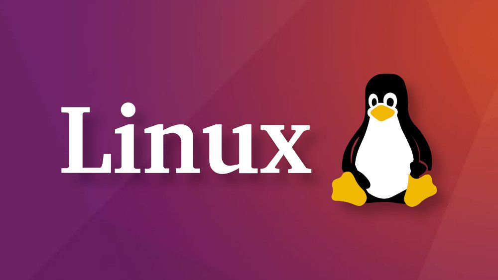

# Guia de Pós-Instalação do Debian

## Introdução

Este guia tem como objetivo auxiliar na configuração inicial de um sistema Debian ou baseado nele, após a instalação. Aqui, abordaremos desde a atualização do sistema até a instalação de pacotes essenciais e configuração de segurança.

## Atualizando repositórios

sudo apt update
sudo apt upgrade -y
sudo apt dist-upgrade -y

## Mudando a senha de root

sudo passwd root

## Instalação de programas básicos

sudo apt install libreoffice
sudo apt install postgresql
sudo apt install synaptic
sudo apt install thunderbird
sudo apt install timeshift
sudo apt install transmission
sudo apt install virtualbox
sudo apt install vlc
sudo apt install xarchiver

## Adicionando o suporte a snaps

No Debian 9 (Stretch) e versões mais recentes, o snap pode ser instalado diretamente da linha de comando:

sudo apt update
sudo apt install snapd

Depois disso, instale o snapd snap para obter o snapd mais recente:

sudo snap install snapd

## Adicionando o suporte ao flathub (caso não seja suportado)

Para instalar o Flatpak no Ubuntu 18.10 (Cosmic Cuttlefish) ou posterior, basta executar:

sudo apt install flatpak

Com versões mais antigas do Ubuntu, o Flatpak PPA oficial é a maneira recomendada de instalar o Flatpak. Para instalá-lo, execute o seguinte em um terminal:

sudo add-apt-repository ppa:flatpak/stable
sudo apt update
sudo apt install flatpak

O plugin Flatpak para o aplicativo Software torna possível instalar aplicativos sem precisar da linha de comando. Para instalar, execute:

sudo apt install gnome-software-plugin-flatpak

Para obter aplicativos Flatpak. Para habilitá-lo, execute;

flatpak remote-add --if-not-exists flathub https://dl.flathub.org/repo/flathub.flatpakrepo

Para concluir a configuração, reinicie seu sistema.

## Adicionando outros aplicativos essenciais

flatpak install flathub io.beekeeperstudio.Studio
flatpak install flathub com.bitwarden.desktop
flatpak install flathub com.usebottles.bottles
flatpak install flathub com.google.Chrome
flatpak install flathub com.microsoft.Edge
flatpak install flathub com.github.johnfactotum.Foliate
flatpak install flathub com.heroicgameslauncher.hgl
flatpak install flathub com.jetbrains.IntelliJ-IDEA-Community
flatpak install flathub org.moneymanagerex.MMEX
flatpak install flathub io.gitlab.news_flash.NewsFlash
flatpak install flathub io.github.peazip.PeaZip
flatpak install flathub com.jetbrains.PyCharm-Community
flatpak install flathub org.standardnotes.standardnotes
flatpak install flathub com.simplenote.Simplenote
flatpak install flathub com.valvesoftware.Steam
flatpak install flathub com.visualstudio.code

## Outros Programas opcionais

flatpak install flathub io.github.btpf.alexandria
flatpak install flathub org.gnome.Boxes
flatpak install flathub com.gitlab.davem.ClamTk
flatpak install flathub io.gitlab.adhami3310.Impression
flatpak install flathub com.obsproject.Studio

## Instalação do Node.js no Debian

Para instalar o Node.js e npm via apt, utilize o seguinte comando:

sudo apt install nodejs npm -y

## Instalação de drivers de vídeo proprietários Nvidia

Os drivers da Nvidia estão disponíveis nos repositórios padrão da distro. Para instalá-los, você precisa ativar os repositórios "non-free-firmware contrib non-free" no Debian. Para poder utilizar os Davinci Resolve e outros programas que usam vídeo acelerado por hardware, além do driver proprietário também é necessário instalar os pacotes CUDA e suas bibliotecas.

Não recomendo usar o script .RUN fornecido pela Nvidia; use os pacotes fornecidos pela distro para facilitar a manutenção do sistema. Ainda não fiz testes com o novo driver open source da NVIDIA, uma vez que ele ainda não está oficialmente disponível nos repositórios do Debian 12.

Após ativar os repositórios extras, faça uma atualização completa do sistema e execute os comandos abaixo:

sudo apt install nvidia-driver nvidia-opencl-icd firmware-misc-nonfree nvidia-cuda-dev nvidia-cuda-toolkit libcuda1 libglu1-mesa libnvidia-encode1 libnvoptix1

## Limpeza Final

Remova pacotes desnecessários para liberar espaço em disco, conforme a seguir:

sudo apt autoremove -y
sudo apt autoclean -y

